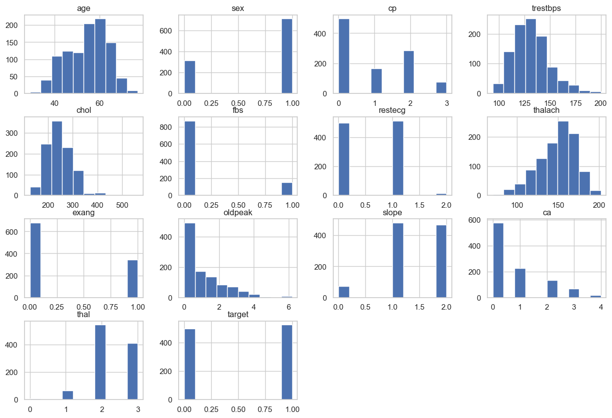
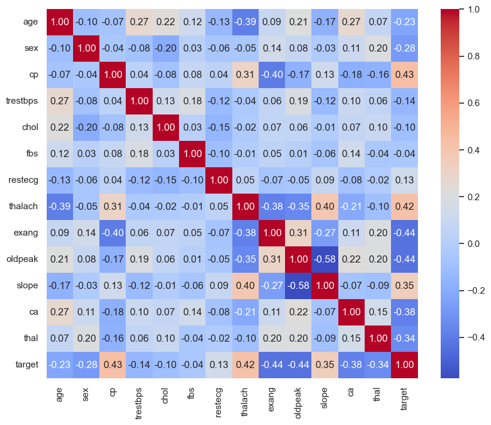
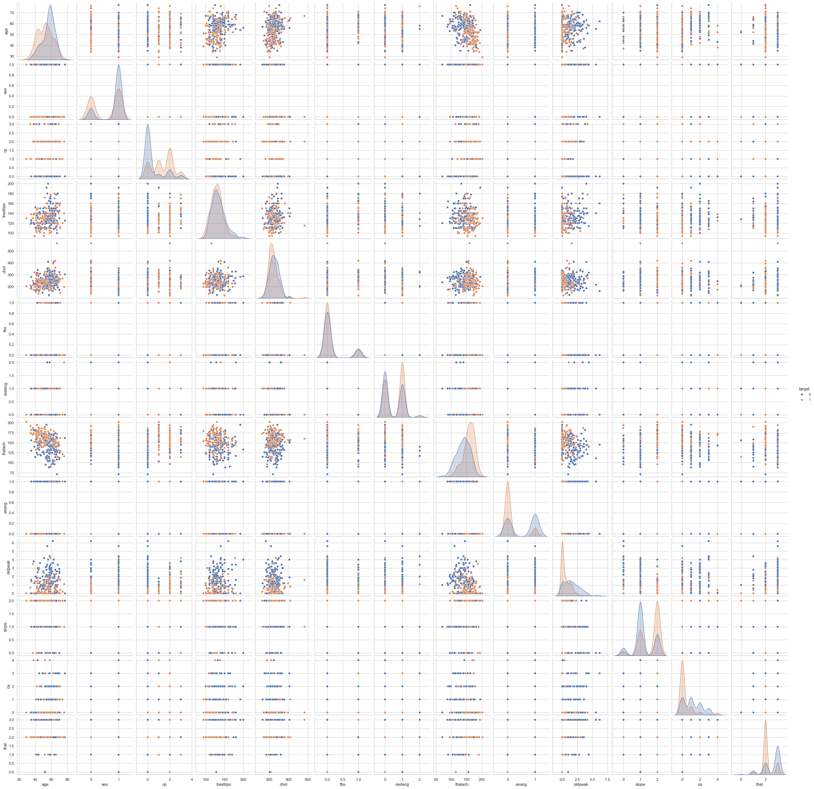
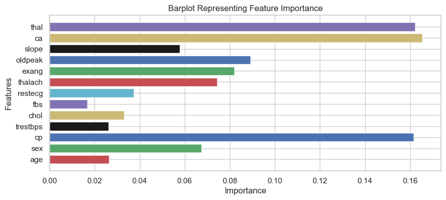
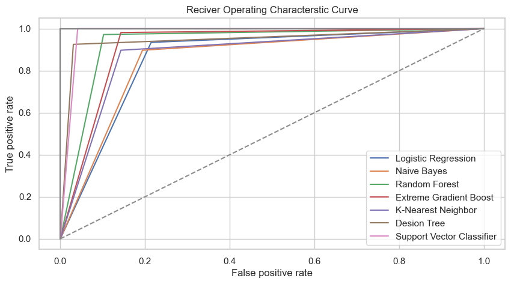
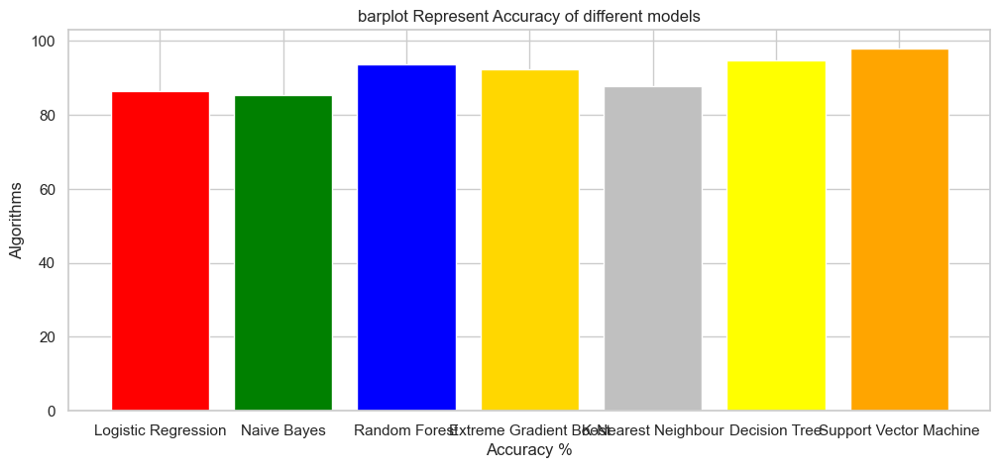

```python
pip install seaborn

```

    Defaulting to user installation because normal site-packages is not writeable
    Collecting seaborn
      Using cached seaborn-0.13.2-py3-none-any.whl (294 kB)
    Requirement already satisfied: numpy!=1.24.0,>=1.20 in /Users/surendrapothuri/Library/Python/3.9/lib/python/site-packages (from seaborn) (1.26.4)
    Requirement already satisfied: pandas>=1.2 in /Users/surendrapothuri/Library/Python/3.9/lib/python/site-packages (from seaborn) (2.2.2)
    Requirement already satisfied: matplotlib!=3.6.1,>=3.4 in /Users/surendrapothuri/Library/Python/3.9/lib/python/site-packages (from seaborn) (3.8.4)
    Requirement already satisfied: cycler>=0.10 in /Users/surendrapothuri/Library/Python/3.9/lib/python/site-packages (from matplotlib!=3.6.1,>=3.4->seaborn) (0.12.1)
    Requirement already satisfied: contourpy>=1.0.1 in /Users/surendrapothuri/Library/Python/3.9/lib/python/site-packages (from matplotlib!=3.6.1,>=3.4->seaborn) (1.2.1)
    Requirement already satisfied: importlib-resources>=3.2.0 in /Users/surendrapothuri/Library/Python/3.9/lib/python/site-packages (from matplotlib!=3.6.1,>=3.4->seaborn) (6.4.0)
    Requirement already satisfied: pillow>=8 in /Users/surendrapothuri/Library/Python/3.9/lib/python/site-packages (from matplotlib!=3.6.1,>=3.4->seaborn) (10.3.0)
    Requirement already satisfied: kiwisolver>=1.3.1 in /Users/surendrapothuri/Library/Python/3.9/lib/python/site-packages (from matplotlib!=3.6.1,>=3.4->seaborn) (1.4.5)
    Requirement already satisfied: pyparsing>=2.3.1 in /Users/surendrapothuri/Library/Python/3.9/lib/python/site-packages (from matplotlib!=3.6.1,>=3.4->seaborn) (3.1.2)
    Requirement already satisfied: python-dateutil>=2.7 in /Users/surendrapothuri/Library/Python/3.9/lib/python/site-packages (from matplotlib!=3.6.1,>=3.4->seaborn) (2.8.2)
    Requirement already satisfied: packaging>=20.0 in /Users/surendrapothuri/Library/Python/3.9/lib/python/site-packages (from matplotlib!=3.6.1,>=3.4->seaborn) (23.2)
    Requirement already satisfied: fonttools>=4.22.0 in /Users/surendrapothuri/Library/Python/3.9/lib/python/site-packages (from matplotlib!=3.6.1,>=3.4->seaborn) (4.51.0)
    Requirement already satisfied: zipp>=3.1.0 in /Users/surendrapothuri/Library/Python/3.9/lib/python/site-packages (from importlib-resources>=3.2.0->matplotlib!=3.6.1,>=3.4->seaborn) (3.17.0)
    Requirement already satisfied: tzdata>=2022.7 in /Users/surendrapothuri/Library/Python/3.9/lib/python/site-packages (from pandas>=1.2->seaborn) (2024.1)
    Requirement already satisfied: pytz>=2020.1 in /Users/surendrapothuri/Library/Python/3.9/lib/python/site-packages (from pandas>=1.2->seaborn) (2024.1)
    Requirement already satisfied: six>=1.5 in /Library/Developer/CommandLineTools/Library/Frameworks/Python3.framework/Versions/3.9/lib/python3.9/site-packages (from python-dateutil>=2.7->matplotlib!=3.6.1,>=3.4->seaborn) (1.15.0)
    Installing collected packages: seaborn
    Successfully installed seaborn-0.13.2
    WARNING: You are using pip version 21.2.4; however, version 24.0 is available.
    You should consider upgrading via the '/Library/Developer/CommandLineTools/usr/bin/python3 -m pip install --upgrade pip' command.
    Note: you may need to restart the kernel to use updated packages.


```python
pip install xgboost

```

    Defaulting to user installation because normal site-packages is not writeable
    Collecting xgboost
      Downloading xgboost-2.0.3-py3-none-macosx_12_0_arm64.whl (1.9 MB)
         |████████████████████████████████| 1.9 MB 1.2 MB/s eta 0:00:01
    [?25hRequirement already satisfied: scipy in /Users/surendrapothuri/Library/Python/3.9/lib/python/site-packages (from xgboost) (1.13.0)
    Requirement already satisfied: numpy in /Users/surendrapothuri/Library/Python/3.9/lib/python/site-packages (from xgboost) (1.26.4)
    Installing collected packages: xgboost
    Successfully installed xgboost-2.0.3
    WARNING: You are using pip version 21.2.4; however, version 24.0 is available.
    You should consider upgrading via the '/Library/Developer/CommandLineTools/usr/bin/python3 -m pip install --upgrade pip' command.
    Note: you may need to restart the kernel to use updated packages.


```python
pip install mlxtend

```

    Defaulting to user installation because normal site-packages is not writeable
    Collecting mlxtend
      Downloading mlxtend-0.23.1-py3-none-any.whl (1.4 MB)
         |████████████████████████████████| 1.4 MB 2.9 MB/s eta 0:00:01
    [?25hRequirement already satisfied: scikit-learn>=1.0.2 in /Users/surendrapothuri/Library/Python/3.9/lib/python/site-packages (from mlxtend) (1.4.2)
    Requirement already satisfied: numpy>=1.16.2 in /Users/surendrapothuri/Library/Python/3.9/lib/python/site-packages (from mlxtend) (1.26.4)
    Requirement already satisfied: joblib>=0.13.2 in /Users/surendrapothuri/Library/Python/3.9/lib/python/site-packages (from mlxtend) (1.4.0)
    Requirement already satisfied: pandas>=0.24.2 in /Users/surendrapothuri/Library/Python/3.9/lib/python/site-packages (from mlxtend) (2.2.2)
    Requirement already satisfied: matplotlib>=3.0.0 in /Users/surendrapothuri/Library/Python/3.9/lib/python/site-packages (from mlxtend) (3.8.4)
    Requirement already satisfied: scipy>=1.2.1 in /Users/surendrapothuri/Library/Python/3.9/lib/python/site-packages (from mlxtend) (1.13.0)
    Requirement already satisfied: fonttools>=4.22.0 in /Users/surendrapothuri/Library/Python/3.9/lib/python/site-packages (from matplotlib>=3.0.0->mlxtend) (4.51.0)
    Requirement already satisfied: cycler>=0.10 in /Users/surendrapothuri/Library/Python/3.9/lib/python/site-packages (from matplotlib>=3.0.0->mlxtend) (0.12.1)
    Requirement already satisfied: python-dateutil>=2.7 in /Users/surendrapothuri/Library/Python/3.9/lib/python/site-packages (from matplotlib>=3.0.0->mlxtend) (2.8.2)
    Requirement already satisfied: pillow>=8 in /Users/surendrapothuri/Library/Python/3.9/lib/python/site-packages (from matplotlib>=3.0.0->mlxtend) (10.3.0)
    Requirement already satisfied: pyparsing>=2.3.1 in /Users/surendrapothuri/Library/Python/3.9/lib/python/site-packages (from matplotlib>=3.0.0->mlxtend) (3.1.2)
    Requirement already satisfied: importlib-resources>=3.2.0 in /Users/surendrapothuri/Library/Python/3.9/lib/python/site-packages (from matplotlib>=3.0.0->mlxtend) (6.4.0)
    Requirement already satisfied: kiwisolver>=1.3.1 in /Users/surendrapothuri/Library/Python/3.9/lib/python/site-packages (from matplotlib>=3.0.0->mlxtend) (1.4.5)
    Requirement already satisfied: packaging>=20.0 in /Users/surendrapothuri/Library/Python/3.9/lib/python/site-packages (from matplotlib>=3.0.0->mlxtend) (23.2)
    Requirement already satisfied: contourpy>=1.0.1 in /Users/surendrapothuri/Library/Python/3.9/lib/python/site-packages (from matplotlib>=3.0.0->mlxtend) (1.2.1)
    Requirement already satisfied: zipp>=3.1.0 in /Users/surendrapothuri/Library/Python/3.9/lib/python/site-packages (from importlib-resources>=3.2.0->matplotlib>=3.0.0->mlxtend) (3.17.0)
    Requirement already satisfied: tzdata>=2022.7 in /Users/surendrapothuri/Library/Python/3.9/lib/python/site-packages (from pandas>=0.24.2->mlxtend) (2024.1)
    Requirement already satisfied: pytz>=2020.1 in /Users/surendrapothuri/Library/Python/3.9/lib/python/site-packages (from pandas>=0.24.2->mlxtend) (2024.1)
    Requirement already satisfied: six>=1.5 in /Library/Developer/CommandLineTools/Library/Frameworks/Python3.framework/Versions/3.9/lib/python3.9/site-packages (from python-dateutil>=2.7->matplotlib>=3.0.0->mlxtend) (1.15.0)
    Requirement already satisfied: threadpoolctl>=2.0.0 in /Users/surendrapothuri/Library/Python/3.9/lib/python/site-packages (from scikit-learn>=1.0.2->mlxtend) (3.5.0)
    Installing collected packages: mlxtend
    Successfully installed mlxtend-0.23.1
    WARNING: You are using pip version 21.2.4; however, version 24.0 is available.
    You should consider upgrading via the '/Library/Developer/CommandLineTools/usr/bin/python3 -m pip install --upgrade pip' command.
    Note: you may need to restart the kernel to use updated packages.


## Table of Contents
### 1) Import Packages

### 2) EDA

### 3) Preparing ML models

### 4) Models evaluation

### 5) Ensembling

### 6) Conclusion

## Packages Required


```python
import pandas as pd
import numpy as np
import matplotlib.pyplot as plt
import seaborn as sns


sns.set(style="whitegrid")
```


```python

from sklearn.preprocessing import StandardScaler
from sklearn.model_selection import train_test_split
from sklearn.metrics import confusion_matrix,accuracy_score,roc_curve,classification_report
from sklearn.linear_model import LogisticRegression
from sklearn.naive_bayes import GaussianNB
from xgboost import XGBClassifier
from sklearn.ensemble import RandomForestClassifier
from sklearn.tree import DecisionTreeClassifier
from sklearn.neighbors import KNeighborsClassifier
from sklearn.naive_bayes import GaussianNB
from sklearn.svm import SVC
from mlxtend.classifier import StackingCVClassifier
from collections import Counter
```


```python
df = pd.read_csv('heart.csv')
```


```python
df.head()
```


<div>
<style scoped>
    .dataframe tbody tr th:only-of-type {
        vertical-align: middle;
    }

    .dataframe tbody tr th {
        vertical-align: top;
    }

    .dataframe thead th {
        text-align: right;
    }
</style>
<table border="1" class="dataframe">
  <thead>
    <tr style="text-align: right;">
      <th></th>
      <th>age</th>
      <th>sex</th>
      <th>cp</th>
      <th>trestbps</th>
      <th>chol</th>
      <th>fbs</th>
      <th>restecg</th>
      <th>thalach</th>
      <th>exang</th>
      <th>oldpeak</th>
      <th>slope</th>
      <th>ca</th>
      <th>thal</th>
      <th>target</th>
    </tr>
  </thead>
  <tbody>
    <tr>
      <th>0</th>
      <td>52</td>
      <td>1</td>
      <td>0</td>
      <td>125</td>
      <td>212</td>
      <td>0</td>
      <td>1</td>
      <td>168</td>
      <td>0</td>
      <td>1.0</td>
      <td>2</td>
      <td>2</td>
      <td>3</td>
      <td>0</td>
    </tr>
    <tr>
      <th>1</th>
      <td>53</td>
      <td>1</td>
      <td>0</td>
      <td>140</td>
      <td>203</td>
      <td>1</td>
      <td>0</td>
      <td>155</td>
      <td>1</td>
      <td>3.1</td>
      <td>0</td>
      <td>0</td>
      <td>3</td>
      <td>0</td>
    </tr>
    <tr>
      <th>2</th>
      <td>70</td>
      <td>1</td>
      <td>0</td>
      <td>145</td>
      <td>174</td>
      <td>0</td>
      <td>1</td>
      <td>125</td>
      <td>1</td>
      <td>2.6</td>
      <td>0</td>
      <td>0</td>
      <td>3</td>
      <td>0</td>
    </tr>
    <tr>
      <th>3</th>
      <td>61</td>
      <td>1</td>
      <td>0</td>
      <td>148</td>
      <td>203</td>
      <td>0</td>
      <td>1</td>
      <td>161</td>
      <td>0</td>
      <td>0.0</td>
      <td>2</td>
      <td>1</td>
      <td>3</td>
      <td>0</td>
    </tr>
    <tr>
      <th>4</th>
      <td>62</td>
      <td>0</td>
      <td>0</td>
      <td>138</td>
      <td>294</td>
      <td>1</td>
      <td>1</td>
      <td>106</td>
      <td>0</td>
      <td>1.9</td>
      <td>1</td>
      <td>3</td>
      <td>2</td>
      <td>0</td>
    </tr>
  </tbody>
</table>
</div>


```python
df.info()
```

    <class 'pandas.core.frame.DataFrame'>
    RangeIndex: 1025 entries, 0 to 1024
    Data columns (total 14 columns):
     #   Column    Non-Null Count  Dtype  
    ---  ------    --------------  -----  
     0   age       1025 non-null   int64  
     1   sex       1025 non-null   int64  
     2   cp        1025 non-null   int64  
     3   trestbps  1025 non-null   int64  
     4   chol      1025 non-null   int64  
     5   fbs       1025 non-null   int64  
     6   restecg   1025 non-null   int64  
     7   thalach   1025 non-null   int64  
     8   exang     1025 non-null   int64  
     9   oldpeak   1025 non-null   float64
     10  slope     1025 non-null   int64  
     11  ca        1025 non-null   int64  
     12  thal      1025 non-null   int64  
     13  target    1025 non-null   int64  
    dtypes: float64(1), int64(13)
    memory usage: 112.2 KB


```python
print(df.isnull().sum())

```

    age         0
    sex         0
    cp          0
    trestbps    0
    chol        0
    fbs         0
    restecg     0
    thalach     0
    exang       0
    oldpeak     0
    slope       0
    ca          0
    thal        0
    target      0
    dtype: int64


```python
print(df.describe())

```

                   age          sex           cp     trestbps        chol  \
    count  1025.000000  1025.000000  1025.000000  1025.000000  1025.00000   
    mean     54.434146     0.695610     0.942439   131.611707   246.00000   
    std       9.072290     0.460373     1.029641    17.516718    51.59251   
    min      29.000000     0.000000     0.000000    94.000000   126.00000   
    25%      48.000000     0.000000     0.000000   120.000000   211.00000   
    50%      56.000000     1.000000     1.000000   130.000000   240.00000   
    75%      61.000000     1.000000     2.000000   140.000000   275.00000   
    max      77.000000     1.000000     3.000000   200.000000   564.00000   
    
                   fbs      restecg      thalach        exang      oldpeak  \
    count  1025.000000  1025.000000  1025.000000  1025.000000  1025.000000   
    mean      0.149268     0.529756   149.114146     0.336585     1.071512   
    std       0.356527     0.527878    23.005724     0.472772     1.175053   
    min       0.000000     0.000000    71.000000     0.000000     0.000000   
    25%       0.000000     0.000000   132.000000     0.000000     0.000000   
    50%       0.000000     1.000000   152.000000     0.000000     0.800000   
    75%       0.000000     1.000000   166.000000     1.000000     1.800000   
    max       1.000000     2.000000   202.000000     1.000000     6.200000   
    
                 slope           ca         thal       target  
    count  1025.000000  1025.000000  1025.000000  1025.000000  
    mean      1.385366     0.754146     2.323902     0.513171  
    std       0.617755     1.030798     0.620660     0.500070  
    min       0.000000     0.000000     0.000000     0.000000  
    25%       1.000000     0.000000     2.000000     0.000000  
    50%       1.000000     0.000000     2.000000     1.000000  
    75%       2.000000     1.000000     3.000000     1.000000  
    max       2.000000     4.000000     3.000000     1.000000  


## EDA


```python
df.hist(figsize=(15, 10))
plt.show()

```


    

    


```python
plt.figure(figsize=(10, 8))
sns.heatmap(df.corr(), annot=True, fmt=".2f", cmap="coolwarm")
plt.show()

```


    

    


```python
sns.pairplot(df, hue='target')
plt.show()

```


    

    


## Model prepration


```python
y = df["target"]
X = df.drop('target',axis=1)
X_train, X_test, y_train, y_test = train_test_split(X, y, test_size=0.20, random_state = 0)
```


```python
print(y_test.unique())
Counter(y_train)
```

    [1 0]


    Counter({1: 419, 0: 401})


```python
scaler = StandardScaler()
X_train = scaler.fit_transform(X_train)
X_test = scaler.transform(X_test)
```

## ML models


#### Logistic Regression
#### Naive Bayes
#### Random Forest Classifier
#### Extreme Gradient Boost
#### K-Nearest Neighbour
#### Decision Tree
#### Support Vector Machine


```python
m1 = 'Logistic Regression'
lr = LogisticRegression()
model = lr.fit(X_train, y_train)
lr_predict = lr.predict(X_test)
lr_conf_matrix = confusion_matrix(y_test, lr_predict)
lr_acc_score = accuracy_score(y_test, lr_predict)
print("confussion matrix")
print(lr_conf_matrix)
print("\n")
print("Accuracy of Logistic Regression:",lr_acc_score*100,'\n')
print(classification_report(y_test,lr_predict))
```

    confussion matrix
    [[ 77  21]
     [  7 100]]
    
    
    Accuracy of Logistic Regression: 86.34146341463415 
    
                  precision    recall  f1-score   support
    
               0       0.92      0.79      0.85        98
               1       0.83      0.93      0.88       107
    
        accuracy                           0.86       205
       macro avg       0.87      0.86      0.86       205
    weighted avg       0.87      0.86      0.86       205
    


```python
m2 = 'Naive Bayes'
nb = GaussianNB()
nb.fit(X_train,y_train)
nbpred = nb.predict(X_test)
nb_conf_matrix = confusion_matrix(y_test, nbpred)
nb_acc_score = accuracy_score(y_test, nbpred)
print("confussion matrix")
print(nb_conf_matrix)
print("\n")
print("Accuracy of Naive Bayes model:",nb_acc_score*100,'\n')
print(classification_report(y_test,nbpred))
```

    confussion matrix
    [[79 19]
     [11 96]]
    
    
    Accuracy of Naive Bayes model: 85.36585365853658 
    
                  precision    recall  f1-score   support
    
               0       0.88      0.81      0.84        98
               1       0.83      0.90      0.86       107
    
        accuracy                           0.85       205
       macro avg       0.86      0.85      0.85       205
    weighted avg       0.86      0.85      0.85       205
    


```python
m3 = 'Random Forest Classfier'
rf = RandomForestClassifier(n_estimators=20, random_state=12,max_depth=5)
rf.fit(X_train,y_train)
rf_predicted = rf.predict(X_test)
rf_conf_matrix = confusion_matrix(y_test, rf_predicted)
rf_acc_score = accuracy_score(y_test, rf_predicted)
print("confussion matrix")
print(rf_conf_matrix)
print("\n")
print("Accuracy of Random Forest:",rf_acc_score*100,'\n')
print(classification_report(y_test,rf_predicted))
```

    confussion matrix
    [[ 88  10]
     [  3 104]]
    
    
    Accuracy of Random Forest: 93.65853658536587 
    
                  precision    recall  f1-score   support
    
               0       0.97      0.90      0.93        98
               1       0.91      0.97      0.94       107
    
        accuracy                           0.94       205
       macro avg       0.94      0.93      0.94       205
    weighted avg       0.94      0.94      0.94       205
    


```python
m4 = 'Extreme Gradient Boost'
xgb = XGBClassifier(learning_rate=0.01, n_estimators=25, max_depth=15,gamma=0.6, subsample=0.52,colsample_bytree=0.6,seed=27, 
                    reg_lambda=2, booster='dart', colsample_bylevel=0.6, colsample_bynode=0.5)
xgb.fit(X_train, y_train)
xgb_predicted = xgb.predict(X_test)
xgb_conf_matrix = confusion_matrix(y_test, xgb_predicted)
xgb_acc_score = accuracy_score(y_test, xgb_predicted)
print("confussion matrix")
print(xgb_conf_matrix)
print("\n")
print("Accuracy of Extreme Gradient Boost:",xgb_acc_score*100,'\n')
print(classification_report(y_test,xgb_predicted))
```

    confussion matrix
    [[ 84  14]
     [  2 105]]
    
    
    Accuracy of Extreme Gradient Boost: 92.19512195121952 
    
                  precision    recall  f1-score   support
    
               0       0.98      0.86      0.91        98
               1       0.88      0.98      0.93       107
    
        accuracy                           0.92       205
       macro avg       0.93      0.92      0.92       205
    weighted avg       0.93      0.92      0.92       205
    


```python
m5 = 'K-NeighborsClassifier'
knn = KNeighborsClassifier(n_neighbors=10)
knn.fit(X_train, y_train)
knn_predicted = knn.predict(X_test)
knn_conf_matrix = confusion_matrix(y_test, knn_predicted)
knn_acc_score = accuracy_score(y_test, knn_predicted)
print("confussion matrix")
print(knn_conf_matrix)
print("\n")
print("Accuracy of K-NeighborsClassifier:",knn_acc_score*100,'\n')
print(classification_report(y_test,knn_predicted))
```

    confussion matrix
    [[84 14]
     [11 96]]
    
    
    Accuracy of K-NeighborsClassifier: 87.8048780487805 
    
                  precision    recall  f1-score   support
    
               0       0.88      0.86      0.87        98
               1       0.87      0.90      0.88       107
    
        accuracy                           0.88       205
       macro avg       0.88      0.88      0.88       205
    weighted avg       0.88      0.88      0.88       205
    


```python
m6 = 'DecisionTreeClassifier'
dt = DecisionTreeClassifier(criterion = 'entropy',random_state=0,max_depth = 6)
dt.fit(X_train, y_train)
dt_predicted = dt.predict(X_test)
dt_conf_matrix = confusion_matrix(y_test, dt_predicted)
dt_acc_score = accuracy_score(y_test, dt_predicted)
print("confussion matrix")
print(dt_conf_matrix)
print("\n")
print("Accuracy of DecisionTreeClassifier:",dt_acc_score*100,'\n')
print(classification_report(y_test,dt_predicted))
```

    confussion matrix
    [[95  3]
     [ 8 99]]
    
    
    Accuracy of DecisionTreeClassifier: 94.6341463414634 
    
                  precision    recall  f1-score   support
    
               0       0.92      0.97      0.95        98
               1       0.97      0.93      0.95       107
    
        accuracy                           0.95       205
       macro avg       0.95      0.95      0.95       205
    weighted avg       0.95      0.95      0.95       205
    


```python
m7 = 'Support Vector Classifier'
svc =  SVC(kernel='rbf', C=2)
svc.fit(X_train, y_train)
svc_predicted = svc.predict(X_test)
svc_conf_matrix = confusion_matrix(y_test, svc_predicted)
svc_acc_score = accuracy_score(y_test, svc_predicted)
print("confussion matrix")
print(svc_conf_matrix)
print("\n")
print("Accuracy of Support Vector Classifier:",svc_acc_score*100,'\n')
print(classification_report(y_test,svc_predicted))
```

    confussion matrix
    [[ 94   4]
     [  0 107]]
    
    
    Accuracy of Support Vector Classifier: 98.04878048780488 
    
                  precision    recall  f1-score   support
    
               0       1.00      0.96      0.98        98
               1       0.96      1.00      0.98       107
    
        accuracy                           0.98       205
       macro avg       0.98      0.98      0.98       205
    weighted avg       0.98      0.98      0.98       205
    


```python
imp_feature = pd.DataFrame({
    'Feature': ['age', 'sex', 'cp', 'trestbps', 'chol', 'fbs', 'restecg', 'thalach', 'exang', 'oldpeak', 'slope', 'ca', 'thal'],
    'Importance': xgb.feature_importances_
})

# Plotting
plt.figure(figsize=(10, 4))
plt.title("Barplot Representing Feature Importance")
plt.xlabel("Importance")
plt.ylabel("Features")
plt.barh(imp_feature['Feature'], imp_feature['Importance'], color=['r', 'g', 'b', 'k', 'y', 'm', 'c', 'r', 'g', 'b', 'k', 'y', 'm'])
plt.show()
```


    

    


```python
lr_false_positive_rate,lr_true_positive_rate,lr_threshold = roc_curve(y_test,lr_predict)
nb_false_positive_rate,nb_true_positive_rate,nb_threshold = roc_curve(y_test,nbpred)
rf_false_positive_rate,rf_true_positive_rate,rf_threshold = roc_curve(y_test,rf_predicted)                                                             
xgb_false_positive_rate,xgb_true_positive_rate,xgb_threshold = roc_curve(y_test,xgb_predicted)
knn_false_positive_rate,knn_true_positive_rate,knn_threshold = roc_curve(y_test,knn_predicted)
dt_false_positive_rate,dt_true_positive_rate,dt_threshold = roc_curve(y_test,dt_predicted)
svc_false_positive_rate,svc_true_positive_rate,svc_threshold = roc_curve(y_test,svc_predicted)


sns.set_style('whitegrid')
plt.figure(figsize=(10,5))
plt.title('Reciver Operating Characterstic Curve')
plt.plot(lr_false_positive_rate,lr_true_positive_rate,label='Logistic Regression')
plt.plot(nb_false_positive_rate,nb_true_positive_rate,label='Naive Bayes')
plt.plot(rf_false_positive_rate,rf_true_positive_rate,label='Random Forest')
plt.plot(xgb_false_positive_rate,xgb_true_positive_rate,label='Extreme Gradient Boost')
plt.plot(knn_false_positive_rate,knn_true_positive_rate,label='K-Nearest Neighbor')
plt.plot(dt_false_positive_rate,dt_true_positive_rate,label='Desion Tree')
plt.plot(svc_false_positive_rate,svc_true_positive_rate,label='Support Vector Classifier')
plt.plot([0,1],ls='--')
plt.plot([0,0],[1,0],c='.5')
plt.plot([1,1],c='.5')
plt.ylabel('True positive rate')
plt.xlabel('False positive rate')
plt.legend()
plt.show()
```


    

    


## Model Evaluation


```python
model_ev = pd.DataFrame({'Model': ['Logistic Regression','Naive Bayes','Random Forest','Extreme Gradient Boost',
                    'K-Nearest Neighbour','Decision Tree','Support Vector Machine'], 'Accuracy': [lr_acc_score*100,
                    nb_acc_score*100,rf_acc_score*100,xgb_acc_score*100,knn_acc_score*100,dt_acc_score*100,svc_acc_score*100]})
model_ev
```


<div>
<style scoped>
    .dataframe tbody tr th:only-of-type {
        vertical-align: middle;
    }

    .dataframe tbody tr th {
        vertical-align: top;
    }

    .dataframe thead th {
        text-align: right;
    }
</style>
<table border="1" class="dataframe">
  <thead>
    <tr style="text-align: right;">
      <th></th>
      <th>Model</th>
      <th>Accuracy</th>
    </tr>
  </thead>
  <tbody>
    <tr>
      <th>0</th>
      <td>Logistic Regression</td>
      <td>86.341463</td>
    </tr>
    <tr>
      <th>1</th>
      <td>Naive Bayes</td>
      <td>85.365854</td>
    </tr>
    <tr>
      <th>2</th>
      <td>Random Forest</td>
      <td>93.658537</td>
    </tr>
    <tr>
      <th>3</th>
      <td>Extreme Gradient Boost</td>
      <td>92.195122</td>
    </tr>
    <tr>
      <th>4</th>
      <td>K-Nearest Neighbour</td>
      <td>87.804878</td>
    </tr>
    <tr>
      <th>5</th>
      <td>Decision Tree</td>
      <td>94.634146</td>
    </tr>
    <tr>
      <th>6</th>
      <td>Support Vector Machine</td>
      <td>98.048780</td>
    </tr>
  </tbody>
</table>
</div>


```python
colors = ['red','green','blue','gold','silver','yellow','orange',]
plt.figure(figsize=(12,5))
plt.title("barplot Represent Accuracy of different models")
plt.xlabel("Accuracy %")
plt.ylabel("Algorithms")
plt.bar(model_ev['Model'],model_ev['Accuracy'],color = colors)
plt.show()
```


    

    


## Ensembling
### In order to increase the accuracy of the model we use ensembling. Here we use stacking technique.


```python
scv=StackingCVClassifier(classifiers=[xgb,knn,svc],meta_classifier= svc,random_state=42)
scv.fit(X_train,y_train)
scv_predicted = scv.predict(X_test)
scv_conf_matrix = confusion_matrix(y_test, scv_predicted)
scv_acc_score = accuracy_score(y_test, scv_predicted)
print("confussion matrix")
print(scv_conf_matrix)
print("\n")
print("Accuracy of StackingCVClassifier:",scv_acc_score*100,'\n')
print(classification_report(y_test,scv_predicted))
```

    confussion matrix
    [[ 94   4]
     [  0 107]]
    
    
    Accuracy of StackingCVClassifier: 98.04878048780488 
    
                  precision    recall  f1-score   support
    
               0       1.00      0.96      0.98        98
               1       0.96      1.00      0.98       107
    
        accuracy                           0.98       205
       macro avg       0.98      0.98      0.98       205
    weighted avg       0.98      0.98      0.98       205
    


## Conclusion
1) The Support Vector Machine (SVM) and the StackingCVClassifier demonstrated the highest accuracy, each achieving an impressive 98.05%. The Decision Tree model also performed notably well, with an accuracy of 94.63%.

2) Exercise induced angina,Chest pain is major symptoms of heart attack.

3) Ensembling technique increase the accuracy of the model.


```python

```
